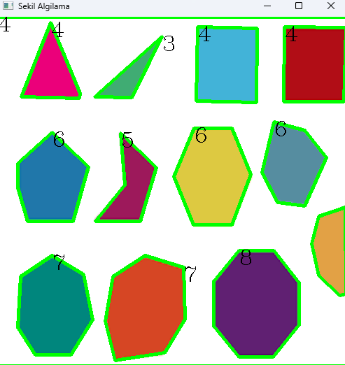

## YÖNTEM :

1. Görüntü gri tonlamaya çevrilir. `cv2.cvtColor()`
2. Eşikleme yapılır. `cv2.treshold()`
3. `cv2.findContours()` ile nesnelerin dış hatları tespit
edilir.
4. Her konturun çevresi `arcLength()` alınır.
5. `cv2.approxPolyDP()` ile çokgen yaklaştırması yapılır.
6. `cv2.drawContours()` ile kontur çizilir.

