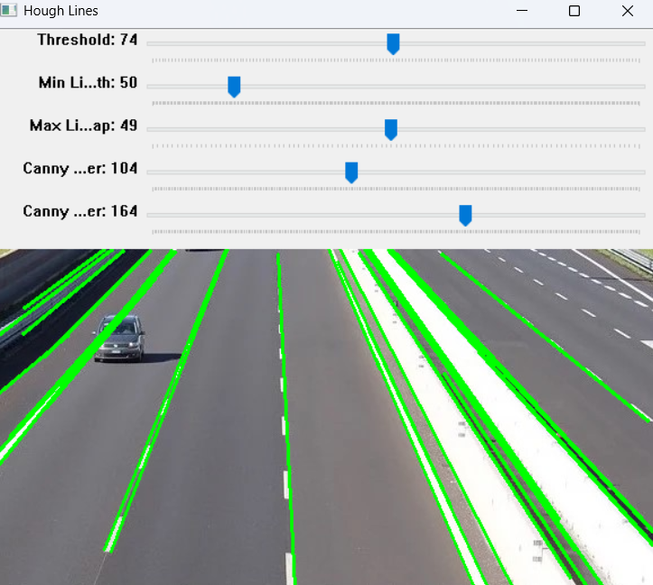

**Hough Line Transform**, OpenCV’de çizgi tespiti için en çok kullanılan yöntemlerden biridir.
özellikle yol şeritleri, kenarlar veya yapısal çizgiler gibi doğrusal şekilleri bulmak için kullanılır.

`cv2.HoughLines()` → Klasik Hough Transform
`cv2.HoughLinesP()` → Probabilistic (Olasılıksal) Hough Transform (daha pratik ve hızlıdır)

`cv2.imread()` : Görüntüyü dosyadan okur.

`cv2.cvtColor()` : Renkli görüntüyü gri tonlamaya çevirir (çizgi tespiti gri görüntüde daha etkilidir).

`lines = cv2.HoughLinesP(edges, 1, np.pi / 180, 30, minLineLength=50, maxLineGap=10)
` : 

1. **edges**: Giriş görüntüsü (kenarlar).
2. **1**: ρ (rho) çözünürlüğü — piksel cinsinden mesafe çözünürlüğü.
3. **np.pi / 180**: θ (theta) çözünürlüğü — radyan cinsinden açı çözünürlüğü.
4. **30**: Eşik değeri (bu değerden daha fazla oy alan çizgiler tespit edilir).
5. **minLineLength=50**: Tespit edilecek minimum çizgi uzunluğu.
6. **maxLineGap=10**: Aynı çizgi üzerindeki boşlukların tolere edilebileceği maksimum değer.

### Özetle HoughLineTransform.py dosyasındaki kod:

1. Görüntüyü okur ve griye çevirir.
2. Canny algoritması ile kenarları bulur.
3. Hough Line Transform ile düz çizgileri tespit eder.
4. Bu çizgileri görüntü üzerinde yeşil olarak işaretler.
5. Sonuç görüntüyü gösterir.

