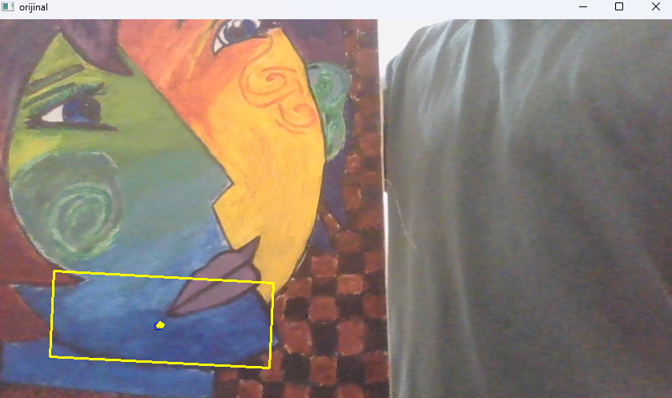

 Renk ile nesne tespiti, belirli bir renk aralığındaki
pikselleri maskeleyerek yapılan bir görüntü işleme tekniğidir.
 Bu yöntem genellikle HSV renk uzayı kullanılarak gerçekleştirilir
çünkü RGB'ye göre daha kararlıdır.
 
 OpenCV kullanarak bir kameradan canlı görüntü alır ve belirli bir renk
aralığında nesne tespiti yapar. Kod aynı zamanda nesnenin hareketini takip eder ve iz bırakır.

**Mavi Renk Nesne Tespiti:**

