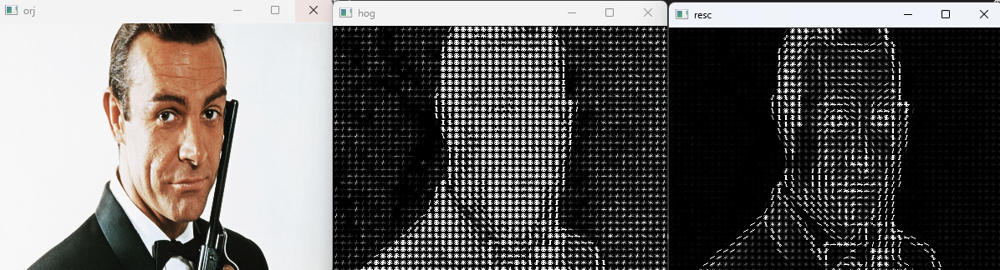
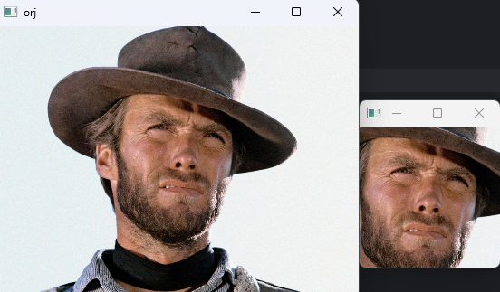

Nesne tanıma (özellikle insan tespiti) için kullanılan
güçlü bir özellik çıkarım yöntemidir. Amacı bir görüntüdeki 
kenarların yönelimi ve yoğunluğu hakkında bilgi çıkararak,
görüntüdeki yapısal özellikleri tanımlamak ve bu bilgileri
makine öğrenmesi modellerine beslemektir.

**HOG ile Yüz  Tespit:** 

**_"Cascade İşleminde bu yüzleri tespit edememiştik."_**

