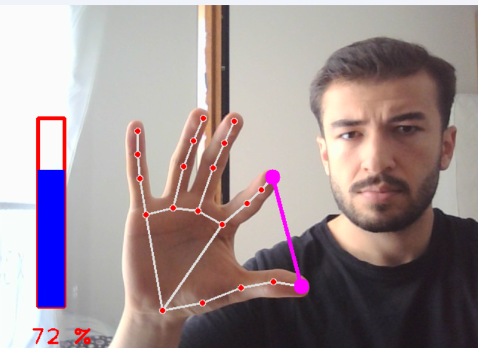

Bu proje, elin iki parmak ucu arasındaki mesafeye
bağlı olarak ses düzeyini ayarlayan bir gesture-based
human-computer interaction örneğidir. MediaPipe’ın doğru
anahtar nokta (landmark) verilerini
sağlaması sayesinde oldukça stabil çalışır. Pycaw ise
doğrudan sistem sesine müdahale etme imkanı sunar.

##### Kullanlanım için gerekli kütüphaneler:

- `mediapipe` : el takibi için (mediapipe için **_python 3.9_** ve üzeri sürümler gereklidir)
- `cv2` : video işleme için
- `pycaw` : windows için ses kontrolü sağlar
- `numpy` : matematiksel işlemler için

