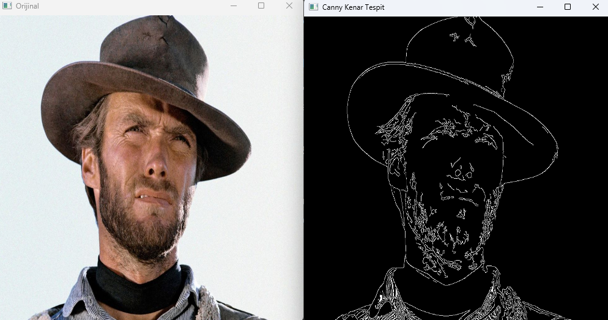

**Canny Kenar Tespit Algoritması**, dijital görüntülerdeki
kenarları tespit etmek için geliştirilmiş bir görüntü
işleme algoritmasıdır. Bu algoritmanın amacı gürültüden
etkilenmemektir.

### Algoritmanın Adımları: 

1. Görüntüyü gri seviyeye dönüştürme
2. Gürültü azaltma (Gaussian Blur)
3. Gradient (eğim) hesaplama
4. Non-maximum suppression (maksimum olmayanları bastırma)
5. Çift eşikleme ve kenarların izlenmesi

**Örnek:**

