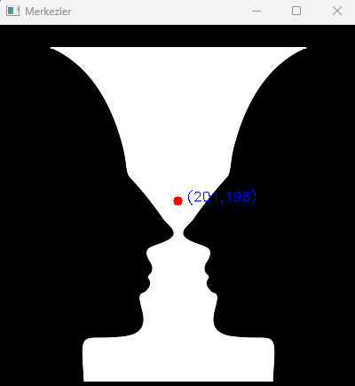

Kontur, bir şeklin dış hatlarını yani sınır çizgisini belirtir.
Genellikle kenar tespitinden sonra uygulanır.
Contours işlemleri şu amaçlarla kullanılır:
- Nesne tespiti ve segmentasyonu
- El hareketi takibi
- Hareketli nesne tespiti
- Optik karakter tanıma (OCR) ön işlemi

OpenCV'deki eşikleme (thresholding) işlemini gerçekleştirir.
Görüntü işleme sürecinde, gri seviyeli bir görüntüyü siyah-beyaz
(binary) hale getirmek için kullanılır.
=> `cv2.threshold()`: _Bu fonksiyon, her bir pikselin değerini kontrol eder
ve belirli bir eşik değerine göre onu 0 ya da belirlenen
maksimum değere (genelde 255) dönüştürür._

* thresh: Eşik değeri (örnekte 127),
* maxval:	Eşik geçildiğinde verilecek maksimum değer (örnekte 255)
* type:	Eşikleme türü (örnekte cv2.THRESH_BINARY)
* ret:	Eşikleme sonucu dönen eşik değeri (genelde önemli değil)
* thresh:	Eşiklenmiş (binary) görüntü çıktısı  => ret, thresh buradaki tresh

`findContours()`, siyah-beyaz (binary) bir görüntüde beyaz alanların sınırlarını bulur.
Her bir kontur, bir şeklin ya da nesnenin kenarını temsil eden bir koordinat dizisidir (numpy array).

#### PARAMETRELERİ: 

`cv2.findContours(image, mode, method)`

**image:**
Eşiklenmiş (binary) görüntü (thresh)

**mode:** (Kontur alma yöntemi)
`cv2.RETR_EXTERNAL` :>	Sadece en dıştaki konturları bulur.
`cv2.RETR_TREE` :>	Tüm konturları ve hiyerarşiyi bulur (iç içe nesneler için idealdir).
`cv2.RETR_LIST` :>	Tüm konturları alır ama hiyerarşi yoktur.

**method:** (Kontur basitleştirme)
`cv2.CHAIN_APPROX_NONE` : Tüm piksel noktalarını alır (yoğun veri).
`cv2.CHAIN_APPROX_SIMPLE` : Gereksiz noktaları kaldırır (daha az veri, daha hızlı).

**contours:** Her bir kontur, koordinat noktalarının bulunduğu bir numpy array listesidir.
**hierarchy:** Konturların birbirine göre hiyerarşisini verir.

### Cismin Merkezini Bulma 

Bir cismin (nesnenin) merkezini bulmak için
konturlar üzerinden moment (momentum) hesaplaması yapılır.
Momentler, bir şeklin geometrik özelliklerini sayısal olarak ifade eden değerlerdir
ve bu sayede kütle merkezi (centroid) elde edilebilir.
-OpenCV’de momentler `cv2.moments()` fonksiyonu ile hesaplanır.

