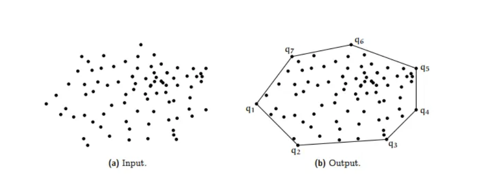
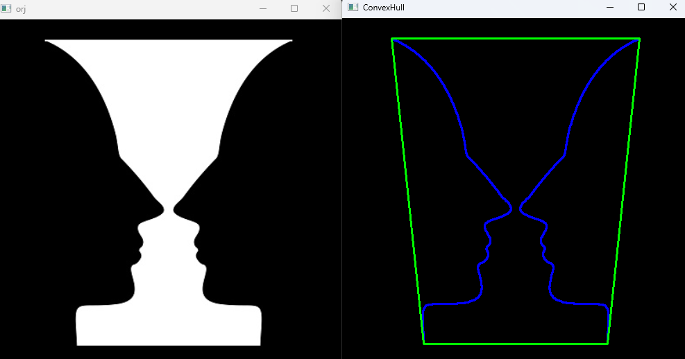

**Convex Hull** (Dışbükey Zarf), bir nesnenin veya noktalar
kümesinin etrafını saran en küçük dışbükey çokgendir.
 Bu çokgen, içerideki tüm noktaları veya nesnenin sınırını tamamen kapsar
ve içe çökme (concavity) noktalarını atlar.
Görüntü işleme ve nesne tespitinde, özellikle el, yüz
veya genel şekil analizinde sıklıkla kullanılır.

#### Temel AdımlarTemel Adımlar

1. İlk olarak, görüntü gri seviyeye dönüştürülür ve ikili
(binary) hale getirilir:
2. Kenarlık (contour) bulma
3. Convex Hull uygulama

#### Kullanılan Fonksiyonlar:

`cv2.convexHull()`: Bir konturun dışbükey zarfını hesaplar.
Sonuç, dışbükey noktaları içeren bir dizidir.

`cv2.drawContours()`: Konturları veya dışbükey zarfı görsel
üzerinde çizer.

